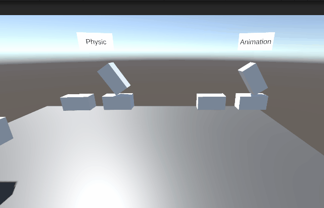
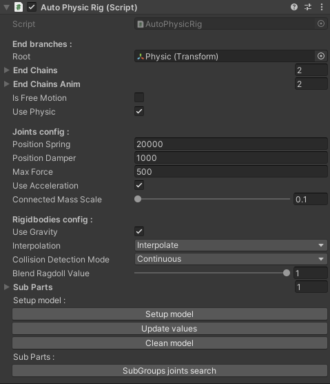
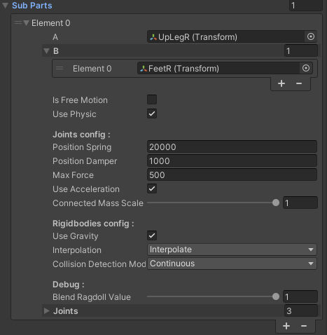
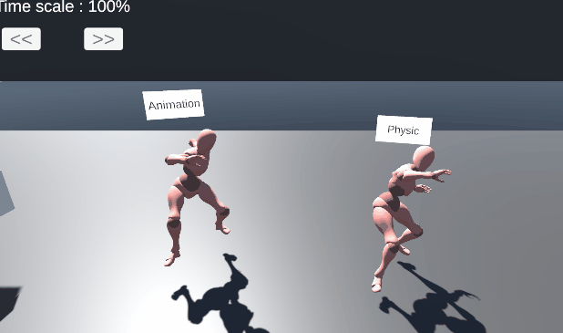
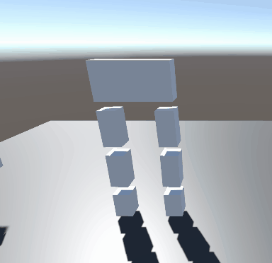

### Welcome to my physic animation tool project 👋

<!-- ABOUT THE PROJECT -->
## About The Project

First of all, this project has the objective of making an animation tool about physics and animation.

## Setup

What are we beginning with? First the script `AutoPhysicRig.cs` needs to be in the scene on an object.

Here's what we need next:
* 1 Model with the animation
* 1 Model with physics (without animations)

Next let's see how to make it work!

On the script:
* __*Root*__ is for the root of the model
* __*End chains*__ are lists of the ends of each branch of the models (end of fingers, head, foot, etc...) in the physics and animate ones
* __*Is Free Motion*__ free the root in space and __*Use Phyic*__ define if the model has physic or not (if change in playmode need to click on `Actualize`)
  
* __*Joints config*__ are for the configurable joints values applied on the model by default if not set before playmode
* __*Rigibodies config*__ is for the rigidbodies values on the physical model
* __*Blend Ragdoll Value*__ Literaly to blend ragdoll 
  
* __*Sub Parts*__ Same thing as the principal script but apply from A to B in a part of the model
  
  
* __*Buttons*__ One to `Set up` the model before playmode for specific values, `Update` to update values and `Clean` to delete components setup before
  `SubGroups` is to search elements between A and B outside playmode

  ## Examples of results

